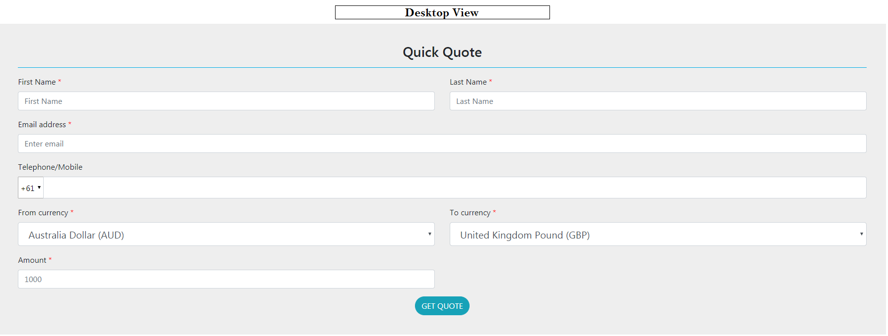
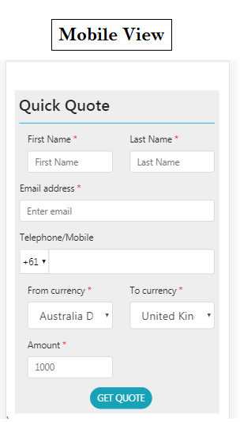

## A Reactjs based online currency calculator with real time exchange rates using OFX API
#Angular 6 based B2C currency calculator app which is based on the ofx currency calculator API

##About OFX
OFX, previously known as OzForex is an Australian online foreign exchange and payments company with headquarters in Sydney.

##Details of API
https://api.ofx.com/PublicSite.ApiService/OFX/spotrate/Individual

##Angular version
This project was generated with [Angular CLI](https://github.com/angular/angular-cli) version 6.0.8.

##Utilization
This app can be used as module in web applications to use the feature of currency calcuator using OFX API. 

###FrontEnd
The front experience is a simple GUI to to take inputs from user :
1. The type currency from which a user wants to convert the currency
2. The currency type to which the user wants to convert the currency
3. The amount 

## Running version of the app
You can experience the app at `https://deepeshdesigns.github.io/ofx/`

## Frontend of the app

## Production server
The current reponsitory is production ready and can be deployed as a standalone application with relevant modifications in the User Experience as intended
